# Fast Plate OCR 中文车牌识别

本项目基于开源项目 [fast-plate-ocr](https://github.com/ankandrew/fast-plate-ocr) 定制，面向中文车牌 OCR
模型的训练、评估和部署。当前工作区采用 **Keras 3 + PyTorch backend** 训练模型，并使用 ONNX Runtime
进行部署侧推理与性能评估。

OCR 模型接收已经裁剪好的车牌图片，只负责识别车牌文字。完整车牌识别系统通常还需要在前面连接车牌检测模型。

## 项目特点

- 使用 PyTorch 作为 Keras 3 训练后端，不安装 TensorFlow 训练依赖。
- 支持指定 GPU、快速训练验证、完整训练和断点模型输出。
- 支持 CBLPRD-330K、CCPD2019 与 CCPD2020 数据转换及合并。
- 支持 `.keras` 和 `.onnx` 两种模型的统一数据集评估。
- 评估结果使用中文展示，包含车牌准确率、字符准确率、长度准确率、推理速度等指标。
- 提供 ONNX 单图推理及 Keras/ONNX 导出前后结果对比工具。

## 默认模型结构详解

当前训练脚本默认使用 `models/cct_s_v2.yaml`。该模型属于 Compact Convolutional Transformer（CCT）：
先用轻量卷积提取局部纹理，再通过 Transformer 建模车牌字符之间的全局关系，最后将整幅图像的视觉 token
压缩为固定数量的车牌位置 token。

模型不是 CTC 或自回归结构，而是固定位置分类结构。每个车牌位置独立输出一次字符概率分布，因此能够并行预测
所有字符，结构简单且适合 ONNX 推理。

### 整体数据流

```mermaid
flowchart LR
    A["车牌图像<br/>(B, 64, 128, 3)"] --> B["Rescaling<br/>像素乘以 1/255"]
    B --> C["卷积 Tokenizer<br/>(B, 32, 64, 112)"]
    C --> D["2x2 PatchExtractor<br/>(B, 512, 448)"]
    D --> E["Patch MLP + 位置编码<br/>(B, 512, 112)"]
    E --> F["5 层 Transformer<br/>(B, 512, 112)"]
    F --> G["TokenReducer<br/>512 token -> 8 token"]
    G --> H["3 层位置 Transformer<br/>(B, 8, 112)"]
    H --> I["字符分类 Softmax<br/>(B, 8, 75)"]
```



其中 `B` 表示 batch size。默认中文车牌配置支持 8 个字符位置和 75 个字符类别，因此每张图片最终输出
`8 × 75 = 600` 个概率值。

### 各阶段张量形状

| 阶段 | 配置或操作 | 输出形状 |
| --- | --- | --- |
| 输入与预处理 | RGB、保持宽高比、填充后缩放到 64×128 | `(B, 64, 128, 3)` |
| Rescaling | `x = x / 255` | `(B, 64, 128, 3)` |
| 卷积 Tokenizer | 4 个 3×3 SiLU 卷积和 1 个 MaxBlurPooling2D | `(B, 32, 64, 112)` |
| PatchExtractor | 不重叠的 2×2 patch，每个 patch 展平为 448 维 | `(B, 512, 448)` |
| Patch MLP | 448 维映射到 Transformer 的 112 维 | `(B, 512, 112)` |
| 位置编码 | 加上可训练的位置向量 | `(B, 512, 112)` |
| 主 Transformer | 5 个全局视觉特征编码块 | `(B, 512, 112)` |
| TokenReducer | 8 个可训练 query 对 512 个视觉 token 做交叉注意力 | `(B, 8, 112)` |
| 位置 Transformer | 3 个字符位置特征编码块 | `(B, 8, 112)` |
| VocabularyProjection | Dropout + 75 类 Dense Softmax | `(B, 8, 75)` |

### 1. 输入与图像预处理

输入尺寸由 `config/cn_plate_config.yaml` 控制：

- 高度：64 像素
- 宽度：128 像素
- 颜色：RGB 三通道
- 保持原始宽高比，多余区域使用像素值 114 填充
- 模型内部再将 `uint8` 像素乘以 `1/255`，映射到 `[0, 1]`

保持宽高比可以减少车牌字符被横向或纵向拉伸的问题。模型只接收已经裁剪的车牌区域，不包含车牌检测模块。

### 2. 卷积 Tokenizer

卷积 stem 使用以下顺序提取边缘、笔画和局部字符纹理：

```text
Conv2D(48, 3x3, SiLU, same)
MaxBlurPooling2D(pool=2, blur_filter=3)
Conv2D(80, 3x3, SiLU, same)
Conv2D(96, 3x3, SiLU, same)
Conv2D(112, 3x3, SiLU, same)
```

`MaxBlurPooling2D` 在最大池化后使用低通滤波，降低下采样导致的混叠，使模型对车牌位置的小幅移动更加稳定。
该阶段只下采样一次，将空间尺寸从 `64×128` 降到 `32×64`，同时将通道数提升到 112。

### 3. Patch 与位置编码

卷积特征图按照 `2×2` 的不重叠区域切分：

- patch 数量：`(32 / 2) × (64 / 2) = 512`
- 每个 patch 的原始维度：`2 × 2 × 112 = 448`
- Patch MLP：`448 -> 112`，使用 SiLU 和 0.2 Dropout

得到的 512 个 token 会加上可训练位置编码。位置编码用于保留字符在车牌上的左右顺序，否则自注意力本身无法区分
两个外观相似但位置不同的字符特征。

### 4. 主 Transformer 编码器

主编码器包含 5 个 `TransformerBlock`。每个块使用 Pre-Norm 残差结构：

```text
x = x + StochasticDepth(MultiHeadAttention(DyT(x)))
x = x + StochasticDepth(MLP(DyT(x)))
```

关键参数如下：

- 特征维度：112
- 注意力头数：2，每头 56 维
- 注意力布局：`split_projection`
- MLP 隐藏层：`[112, 112]`
- 激活函数：SiLU
- 注意力 Dropout：0.1
- MLP Dropout：0.2
- 归一化：Dynamic Tanh（DyT）
- Stochastic Depth：从 0 线性增加到 0.12

自注意力让每个局部区域同时参考整张车牌，例如在模糊或遮挡情况下利用字符上下文和相邻位置特征进行判断。
Stochastic Depth 只在训练期间随机跳过部分残差分支，用于减轻过拟合。

### 5. TokenReducer：从图像区域到字符位置

主 Transformer 输出 512 个视觉 token，但中文车牌配置最多只有 8 个字符位置。`TokenReducer` 使用 8 个
可训练 query token，通过 4 头交叉注意力从 512 个视觉 token 中提取位置特征：

```text
query = 8 个可训练位置 token
key/value = 512 个视觉 token
output = CrossAttention(query, key, value) + query
```

输出再经过 DyT 归一化，形状从 `(B, 512, 112)` 变为 `(B, 8, 112)`。这些位置不是通过人工裁切得到，
而是在训练中自动学习应当关注车牌的第 1 至第 8 个字符区域。

与直接对整幅特征图做平均池化相比，TokenReducer 保留了字符顺序；与为每个字符单独运行一个网络相比，它又能共享
卷积和 Transformer 特征。

### 6. 字符位置建模与输出头

TokenReducer 后还有 3 个 TransformerBlock，用于建模 8 个字符位置之间的关系。随后
`VocabularyProjection` 对每个位置执行：

```text
Dropout(0.2) -> Dense(75, Softmax)
```

最终 `plate` 输出为 `(B, 8, 75)`：

- 第二维对应最多 8 个车牌字符位置。
- 第三维对应 `config/cn_plate_config.yaml` 中的 75 个字符类别。
- 75 类包含数字、英文字母、中文省份/车牌类型字符和补位字符 `_`。
- 推理时每个位置取概率最大的类别，并删除车牌尾部的 `_`，得到实际长度的车牌文本。

训练默认使用带 0.01 label smoothing 的分类交叉熵，也可以通过 `--plate-loss focal_cce` 使用 focal loss。
训练过程同时统计字符准确率、完整车牌准确率、Top-3 字符准确率和车牌长度准确率。

### 7. 可选区域分类分支

模型构建器还支持可选的区域分类头。当车牌配置包含 `plate_regions` 且数据集提供区域标签时，8 个位置 token 会经过
额外 Transformer、SequencePooling 和 Dense Softmax，输出地区或国家类别。

当前 `config/cn_plate_config.yaml` 没有定义 `plate_regions`，因此默认训练只启用 `plate` 字符识别头。

### 8. 模型规模与配置关系

使用当前 `cct_s_v2` 和中文车牌配置实际构建出的模型规模如下：

| 项目 | 数值 |
| --- | ---: |
| 总参数量 | 981,452 |
| 可训练参数 | 981,020 |
| 非训练参数 | 432 |
| Float32 参数存储量 | 约 3.74 MB |
| 输入形状 | `(B, 64, 128, 3)` |
| 车牌输出形状 | `(B, 8, 75)` |

模型由两类配置共同决定：

| 配置文件 | 控制内容 |
| --- | --- |
| `models/cct_s_v2.yaml` | 卷积层、patch、Transformer 层数、注意力头、特征维度、Dropout 和归一化 |
| `config/cn_plate_config.yaml` | 输入尺寸、颜色模式、字符集、补位字符和最大车牌位置数 |

修改 `alphabet` 会改变最后一维类别数，修改 `max_plate_slots` 会改变 TokenReducer query 数量和输出位置数。
训练、评估和推理必须使用同一份 `plate_config.yaml`，否则输出无法正确解码。

## 目录说明

```text
fast-plate-ocr/
├── config/                 # 车牌字符集与图像预处理配置
├── data_convert/           # CBLPRD、CCPD 转换和数据集合并脚本
├── fast_plate_ocr/         # OCR 训练、推理和导出核心代码
├── models/                 # 模型结构配置
├── requirements/           # PyTorch-only 训练环境依赖
├── scripts/                # 环境、训练、评估、导出和推理脚本
├── trained_models/         # 默认模型输出目录
└── test/                   # 项目测试
```

本文档中的命令均从项目根目录执行：

```bash
cd /zxk/plate_ocr/plate/fast-plate-ocr
```

## 环境要求

当前环境针对以下基础运行条件配置：

- Python 3.10 或更高版本
- PyTorch 2.4.0
- torchvision 0.19.0
- 可用的 PyTorch GPU/PPU 加速设备
- 系统中未安装 TensorFlow

环境脚本不会重新安装或升级 PyTorch，而是保留已有的 PyTorch 与 torchvision 版本。

### 1. 安装训练环境

如果合并数据集尚未生成，先跳过数据集验证：

```bash
python3 scripts/plate_workflow.py setup --skip-verify
```

该命令将：

1. 确认 TensorFlow 未安装。
2. 确认 PyTorch 和 torchvision 已安装。
3. 安装 `requirements/train-torch.txt` 中的训练依赖。
4. 安装 ONNX、ONNX Runtime、ONNX Script 和 ONNX Slim。
5. 以 editable 模式安装当前项目，但不安装额外依赖。

如需使用其他 Python 解释器：

```bash
PYTHON_BIN=/path/to/python python3 scripts/plate_workflow.py setup --skip-verify
```

## 数据集格式

训练和评估数据使用以下目录格式：

```text
dataset-root/
├── train/
│   ├── annotations.csv
│   └── images/
├── val/
│   ├── annotations.csv
│   └── images/
└── plate_config.yaml
```

`annotations.csv` 必须包含以下两列：

```csv
image_path,plate_text
images/example.jpg,京A12345
```

`image_path` 相对于 CSV 所在目录解析，`plate_text` 中的字符必须包含在
`config/cn_plate_config.yaml` 的 `alphabet` 内，车牌长度不能超过 `max_plate_slots`。

## 数据转换

### 1. 转换 CBLPRD-330K

```bash
python3 data_convert/CBLPRD2Fastocr.py \
  --dataset-root /zxk/plate_ocr/plate/CBLPRD-330K \
  --out-dir /zxk/plate_ocr/plate/CBLPRD-330K/fast-plate-ocr
```

脚本保留原始 `train` 和 `val` 划分，并通过硬链接复用车牌图片，避免复制大规模数据。

### 2. 转换 CCPD2019

```bash
python3 data_convert/CCPD2Fastocr.py \
  --dataset-root /zxk/plate_ocr/plate/CCPD/OpenDataLab___CCPD/raw/CCPD2019 \
  --out-dir /zxk/plate_ocr/plate/CCPD/fast-plate-ocr \
  --workers 16
```

CCPD 文件名中包含车牌文字和四边形坐标。转换脚本会解析标签、透视矫正车牌区域，并按 CCPD 子集生成
`annotations.csv`。

### 3. 转换 CCPD2020

```bash
python3 data_convert/CCPD20202Fastocr.py \
  --dataset-root /zxk/plate_ocr/plate_ocr/asserts/CCPD/CCPD2020 \
  --out-dir /zxk/plate_ocr/plate_ocr/asserts/CCPD/CCPD2020/fast-plate-ocr \
  --workers 16
```

转换脚本将 CCPD2020 的 `train` 与 `test` 合并为训练集，并保留原始 `val` 作为验证集。

### 4. 合并 CBLPRD、CCPD2019 与 CCPD2020

```bash
python3 data_convert/merge_cblprd_ccpd.py \
  --cblprd-root /zxk/plate_ocr/plate/CBLPRD-330K/fast-plate-ocr \
  --ccpd-root /zxk/plate_ocr/plate/CCPD/fast-plate-ocr \
  --ccpd2020-root /zxk/plate_ocr/plate_ocr/asserts/CCPD/CCPD2020/fast-plate-ocr \
  --out-dir /zxk/plate_ocr/plate/FastOCRData \
  --cblprd-ratio 1.0 \
  --ccpd-ratio 1.0 \
  --ccpd2020-ratio 1.0 \
  --ccpd-val-ratio 0.2
```

合并规则：

- CBLPRD 与 CCPD2020 保留各自的 `train` 和 `val` 划分，并在每个划分内独立抽样。
- 排除 `ccpd_blur`。
- `ccpd_base`、`ccpd_challenge`、`ccpd_db`、`ccpd_fn`、`ccpd_rotate`、`ccpd_tilt` 和
  `ccpd_weather` 先按 CCPD2019 加入比例抽样，再分别划分训练集和验证集。
- `--cblprd-ratio`、`--ccpd-ratio` 和 `--ccpd2020-ratio` 分别控制三套数据的加入比例，
  取值范围为 `0` 到 `1`，默认均为 `1.0`；设为 `0` 时跳过对应数据集。
- 默认 `--ccpd-val-ratio` 为 `0.2`，即每个允许的 CCPD 子集约 20% 用于验证。
- 数据抽样与 CCPD2019 划分基于数据来源、分组名和文件名的 SHA-256 排序，相同输入与比例会得到相同结果。
- 输出图片使用硬链接，源数据与输出目录需要位于支持硬链接的同一文件系统。
- 输出目录必须不存在或为空；失败时临时输出会自动清理。

合并完成后会额外生成 `merge_report.json` 和 `plate_config.yaml`。

## 环境与数据验证

数据准备完成后执行完整验证：

```bash
KERAS_BACKEND=torch \
FAST_PLATE_OCR_DATASET_ROOT=/zxk/plate_ocr/plate/FastOCRData \
python3 scripts/verify_pytorch_training_env.py
```

该脚本会验证 PyTorch backend、加速设备、PyTorch 版本、数据标注、图片引用、字符集和一次模型前向计算。

## 模型训练

### 快速训练验证

先用少量 epoch 检查完整训练链路：

```bash
FAST_PLATE_OCR_DATASET_ROOT=/zxk/plate_ocr/plate/FastOCRData \
python3 scripts/plate_workflow.py train --quick --gpu 0
```

快速模式默认训练 3 个 epoch，输出到 `trained_models/quick_test`。

### 完整训练

```bash
FAST_PLATE_OCR_DATASET_ROOT=/zxk/plate_ocr/plate/FastOCRData \
FAST_PLATE_OCR_MODEL_CONFIG=models/cct_xs_v2.yaml \
FAST_PLATE_OCR_EPOCHS=200 \
FAST_PLATE_OCR_BATCH_SIZE=1024 \
FAST_PLATE_OCR_WORKERS=16 \
FAST_PLATE_OCR_OUTPUT_DIR=trained_models/cblprd_ccpd_cct_xs_v2_torch \
python3 scripts/plate_workflow.py train --gpu 1
```

`--gpu` 指定物理设备编号，脚本会将其写入 `CUDA_VISIBLE_DEVICES`。也可以使用环境变量：

```bash
FAST_PLATE_OCR_GPU=1 \
FAST_PLATE_OCR_DATASET_ROOT=/zxk/plate_ocr/plate/FastOCRData \
python3 scripts/plate_workflow.py train
```

常用训练环境变量：

| 环境变量 | 默认值 | 用途 |
| --- | --- | --- |
| `FAST_PLATE_OCR_DATASET_ROOT` | `/zxk/plate_ocr/plate/FastOCRData` | 训练数据根目录 |
| `FAST_PLATE_OCR_MODEL_CONFIG` | `models/cct_s_v2.yaml` | 模型结构配置 |
| `FAST_PLATE_OCR_PLATE_CONFIG` | `config/cn_plate_config.yaml` | 字符集与预处理配置 |
| `FAST_PLATE_OCR_EPOCHS` | `200` | 训练轮数 |
| `FAST_PLATE_OCR_BATCH_SIZE` | `1024` | batch size |
| `FAST_PLATE_OCR_LR` | `0.001` | 初始学习率 |
| `FAST_PLATE_OCR_WORKERS` | `16` | 数据加载线程数 |
| `FAST_PLATE_OCR_OUTPUT_DIR` | `trained_models/cblprd_cct_s_v2_torch` | 模型输出根目录 |
| `FAST_PLATE_OCR_GPU` | 未设置 | GPU/PPU 设备编号 |

训练输出目录中通常包含 `best.keras`、`last.keras`、`model_config.yaml`、`plate_config.yaml` 和训练日志。

## 模型评估

评估脚本同时支持 Keras(PyTorch backend) 和 ONNX 模型，并显示进度条和中文指标。

### 评估 Keras 模型

```bash
python3 scripts/evaluate_model.py \
  --model trained_models/cblprd_ccpd_cct_s_v2_torch/<run>/best.keras \
  --dataset /zxk/plate_ocr/plate/FastOCRData/val \
  --plate-config config/cn_plate_config.yaml \
  --device cuda \
  --gpu 0 \
  --batch-size 256 \
  --workers 8 \
  --output trained_models/cblprd_ccpd_cct_s_v2_torch/evaluation-keras.json
```

### 评估 ONNX 模型

```bash
python3 scripts/evaluate_model.py \
  --model /path/to/model.onnx \
  --dataset /zxk/plate_ocr/plate/FastOCRData/val \
  --plate-config config/cn_plate_config.yaml \
  --device cuda \
  --gpu 0 \
  --output /path/to/evaluation-onnx.json
```

`--dataset` 可以是单个 CSV、包含 `annotations.csv` 的数据集目录，或包含多个分组数据集的根目录。
主要输出指标包括完整车牌准确率、字符准确率、车牌长度准确率、平均编辑距离、推理耗时和吞吐量。

## 模型性能评估结果

2026 年 7 月 30 日，使用同一套配置在完整 CCPD FastOCR 数据集上评估了 CCT-S v2 和 CCT-XS v2 两个 PyTorch 后端模型。
   指标                      CCT-S v2         CCT-XS v2
  ━━━━━━━━━━━━━━━━━━  ━━━━━━━━━━━━━━━━  ━━━━━━━━━━━━━━━━
   整牌识别准确率              99.64%            99.23%
  ──────────────────  ────────────────  ────────────────
   字符准确率                  99.91%            99.85%
  ──────────────────  ────────────────  ────────────────
   长度准确率                 100.00%           100.00%
  ──────────────────  ────────────────  ────────────────
   ccpd_blur 准确率            98.58%            96.89%
  ──────────────────  ────────────────  ────────────────
   参数量                     981,452           584,952
  ──────────────────  ────────────────  ────────────────
   推理吞吐量          1,699.30 张/秒    1,809.64 张/秒
  ──────────────────  ────────────────  ────────────────
   平均推理耗时               0.59 ms           0.55 ms
| 评估项 | 配置 |
| --- | --- |
| 数据集 | `/zxk/plate_ocr/plate/CCPD/fast-plate-ocr` |
| 样本数 | 351,977 张裁剪车牌图片 |
| 数据分组 | `ccpd_base`、`ccpd_blur`、`ccpd_challenge`、`ccpd_db`、`ccpd_fn`、`ccpd_rotate`、`ccpd_tilt`、`ccpd_weather` |
| 运行设备 | `cuda:0` |
| Keras 后端 | PyTorch |
| Batch size / Workers | 256 / 8 |
| 模型输入 | `B×64×128×3` RGB 图像 |
| 模型输出 | `plate_logits`，形状为 `B×8×75` |

> **数据口径说明：** 两个模型的训练集由 CBLPRD 和 CCPD 合并得到。除 `ccpd_blur` 外，其他 CCPD 分组均按比例参与过训练集和验证集划分。因此，下表“全量 CCPD”结果用于比较两个模型在相同数据上的表现，不应视为严格的独立测试集成绩；未参与合并训练的 `ccpd_blur` 更适合观察模型的泛化能力。

### 指标说明

- **Precision / Recall / F1：** 将完整车牌字符串视为一个类别，并对每张图片输出一个预测时的 micro 指标。该口径下三者均等于整牌 exact match 准确率，不是车牌检测任务的 Precision、Recall 和 F1。
- **识别准确率：** 预测车牌字符串与真实车牌字符串完全一致的样本比例，也称整牌准确率或 exact match。
- **字符准确率：** 逐位置比较字符预测的准确率，包含补齐位置。
- **车牌长度准确率：** 预测字符串长度与真实字符串长度一致的样本比例。
- **Top-3 字符准确率：** 每个字符位置的真实类别出现在前三个候选中的比例。
- **CER：** 字符错误率，基于预测字符串与真实字符串的编辑距离计算，越低越好。
- **Params：** 模型可训练与不可训练参数总量。
- **推理速度：** 仅统计模型前向推理；端到端吞吐量还包括数据读取、预处理和指标计算。

### 总体结果

| 指标 | CCT-S v2 | CCT-XS v2 |
| --- | ---: | ---: |
| 评估样本数 | 351,977 | 351,977 |
| 完全正确样本数 | 350,699 | 349,269 |
| Precision | 99.64% | 99.23% |
| Recall | 99.64% | 99.23% |
| F1 | 99.64% | 99.23% |
| 识别准确率 | 99.64% | 99.23% |
| 字符准确率 | 99.91% | 99.85% |
| 车牌长度准确率 | 100.00% | 100.00% |
| Top-3 字符准确率 | 99.96% | 99.94% |
| CER | 0.10% | 0.17% |
| Params | 981,452 | 584,952 |
| 模型文件大小 | 15.55 MiB | 9.38 MiB |
| 平均推理耗时 | 0.59 ms/张 | 0.55 ms/张 |
| P50 / P95 推理耗时 | 0.56 / 0.93 ms | 0.32 / 1.35 ms |
| 纯推理吞吐量 | 1,699.30 张/秒 | 1,809.64 张/秒 |
| 端到端吞吐量 | 1,325.16 张/秒 | 1,397.79 张/秒 |

### 1. CCT-S v2 模型

CCT-S v2 基于裁剪得到的车牌 ROI，输出最多 8 个字符位置的分类结果。模型输入为 `64×128` RGB 图像，`plate_logits` 输出形状为 `B×8×75`。该模型不包含车牌检测分支和颜色分类分支，本次评估仅统计字符序列识别性能。

| CCPD 分组 | 样本数 | 识别准确率 | 字符准确率 |
| --- | ---: | ---: | ---: |
| `ccpd_base` | 199,996 | 99.98% | 100.00% |
| `ccpd_blur` | 20,611 | 98.58% | 99.77% |
| `ccpd_challenge` | 50,003 | 98.80% | 99.67% |
| `ccpd_db` | 10,132 | 98.94% | 99.80% |
| `ccpd_fn` | 20,967 | 99.32% | 99.79% |
| `ccpd_rotate` | 10,053 | 99.74% | 99.88% |
| `ccpd_tilt` | 30,216 | 99.79% | 99.95% |
| `ccpd_weather` | 9,999 | 99.94% | 99.99% |

结论：CCT-S v2 在 351,977 张 CCPD 图片上的识别准确率为 99.64%，字符准确率为 99.91%。在未参与合并训练的 `ccpd_blur` 分组上，整牌识别准确率为 98.58%，说明该模型对模糊车牌仍保持较好的泛化能力。在本次比较中，CCT-S v2 的准确率和困难场景稳定性更优。

[查看 CCT-S v2 完整 JSON 评估报告](trained_models/cblprd_ccpd_cct_s_v2_torch/2026-07-29_13-47-11/ccpd_evaluation.json)

### 2. CCT-XS v2 模型

CCT-XS v2 与 CCT-S v2 使用相同的输入、输出和解码方式，但参数量减少到 584,952，模型文件缩小到 9.38 MiB，更适合对存储和推理吞吐量要求较高的部署环境。该模型同样只输出车牌字符序列，不输出车牌颜色。

| CCPD 分组 | 样本数 | 识别准确率 | 字符准确率 |
| --- | ---: | ---: | ---: |
| `ccpd_base` | 199,996 | 99.97% | 100.00% |
| `ccpd_blur` | 20,611 | 96.89% | 99.52% |
| `ccpd_challenge` | 50,003 | 97.61% | 99.48% |
| `ccpd_db` | 10,132 | 97.22% | 99.54% |
| `ccpd_fn` | 20,967 | 98.54% | 99.64% |
| `ccpd_rotate` | 10,053 | 99.56% | 99.85% |
| `ccpd_tilt` | 30,216 | 99.43% | 99.90% |
| `ccpd_weather` | 9,999 | 99.88% | 99.98% |

结论：CCT-XS v2 在全量 CCPD 上取得 99.23% 的识别准确率和 99.85% 的字符准确率。其纯推理吞吐量比 CCT-S v2 高约 6.49%，参数量减少约 40.40%，但整牌识别准确率降低约 0.41 个百分点；在未参与合并训练的 `ccpd_blur` 上，识别准确率为 96.89%。

[查看 CCT-XS v2 完整 JSON 评估报告](trained_models/cblprd_ccpd_cct_xs_v2_torch/2026-07-29_14-14-43/ccpd_evaluation.json)

### 模型选择建议

- 优先考虑识别准确率和模糊、困难场景鲁棒性时，选择 CCT-S v2。
- 优先考虑参数量、模型体积和推理吞吐量时，选择 CCT-XS v2。
- 正式发布指标前，建议另外固定一个不参与训练和调参的独立测试集，避免训练数据重叠对结果造成偏高估计。

## 单张图片测试

输入必须是已经裁剪好的车牌图片。

### 测试 Keras 模型

```bash
python3 scripts/test_single_image.py \
  --image /path/to/cropped_plate.jpg \
  --model /path/to/best.keras \
  --plate-config config/cn_plate_config.yaml \
  --keras-backend torch
```

### 测试 ONNX 模型

```bash
python3 scripts/test_single_image.py \
  --image /path/to/cropped_plate.jpg \
  --model /path/to/model.onnx \
  --plate-config config/cn_plate_config.yaml \
  --device cuda
```

## ONNX 导出与结果对比

导出脚本使用方法：

```bash
python3 scripts/plate_workflow.py export /path/to/best.keras
```

如果不指定模型路径，脚本会在 `FAST_PLATE_OCR_TRAIN_OUTPUT_DIR` 下选择修改时间最新的 `best.keras`。
可以通过 `FAST_PLATE_OCR_ONNX_OUTPUT_DIR` 指定输出目录。

> **当前限制：** `plate_workflow.py export` 当前会将 `KERAS_BACKEND` 设置为 `tensorflow`，而环境安装流程要求
> TensorFlow 不存在。因此严格 PyTorch-only 环境中暂不应执行该导出入口，也不应为了导出单独安装 TensorFlow。
> 使用该入口前需要先将导出实现调整为已验证的 PyTorch backend ONNX 导出路径。

已有 Keras 和 ONNX 模型后，可以比较两者在同一图片上的输出：

```bash
python3 scripts/compare_model_outputs.py \
  --image /path/to/cropped_plate.jpg \
  --keras-model /path/to/best.keras \
  --onnx-model /path/to/model.onnx \
  --plate-config config/cn_plate_config.yaml \
  --keras-backend torch \
  --device cuda
```

脚本会输出两种模型的车牌文本、输出形状、最大绝对误差、最大相对误差以及是否满足容差要求。

## 脚本速查

| 脚本 | 用途 |
| --- | --- |
| `scripts/plate_workflow.py setup` | 安装并验证 PyTorch 训练环境 |
| `scripts/plate_workflow.py train` | 使用 Keras PyTorch backend 训练模型 |
| `scripts/plate_workflow.py export` | 导出 ONNX，当前存在上述 backend 限制 |
| `scripts/verify_pytorch_training_env.py` | 验证环境、数据集和模型前向计算 |
| `scripts/evaluate_model.py` | 评估 Keras 或 ONNX 模型 |
| `scripts/test_single_image.py` | 对单张裁剪车牌图片推理 |
| `scripts/compare_model_outputs.py` | 比较 Keras 与 ONNX 输出 |
| `data_convert/CBLPRD2Fastocr.py` | 转换 CBLPRD-330K |
| `data_convert/CCPD2Fastocr.py` | 转换并裁剪 CCPD2019 |
| `data_convert/CCPD20202Fastocr.py` | 转换并裁剪 CCPD2020 |
| `data_convert/merge_cblprd_ccpd.py` | 合并 CBLPRD、CCPD2019 与 CCPD2020 训练数据 |

所有脚本都可以通过 `--help` 查看完整参数，例如：

```bash
python3 scripts/evaluate_model.py --help
python3 data_convert/merge_cblprd_ccpd.py --help
```

## 常见问题

### 提示 TensorFlow 已安装

环境脚本会拒绝包含 TensorFlow 的 Python 环境。请使用独立的 PyTorch-only 虚拟环境，不要直接卸载其他项目依赖。

### 找不到训练数据

确认 `FAST_PLATE_OCR_DATASET_ROOT` 指向包含 `train/annotations.csv` 和 `val/annotations.csv` 的目录。

### 合并数据时报硬链接错误

硬链接不能跨文件系统。将输出目录放到与源数据相同的文件系统，并确保输出目录为空。

### GPU 不可用或选错设备

先运行环境验证脚本，再检查 `--gpu` 或 `FAST_PLATE_OCR_GPU`。传入的编号对应 `CUDA_VISIBLE_DEVICES`
暴露前的物理设备编号。

### ONNX CUDA 评估失败

确认安装的是支持当前加速平台的 ONNX Runtime，并通过以下命令检查执行提供程序：

```bash
python3 -c "import onnxruntime as ort; print(ort.get_available_providers())"
```

## 上游项目与许可证

本项目基于 [ankandrew/fast-plate-ocr](https://github.com/ankandrew/fast-plate-ocr)，核心模型采用轻量级卷积与
Compact Convolutional Transformer 结构。上游文档见
[fast-plate-ocr documentation](https://ankandrew.github.io/fast-plate-ocr/)。

项目使用 [MIT License](LICENSE)。
